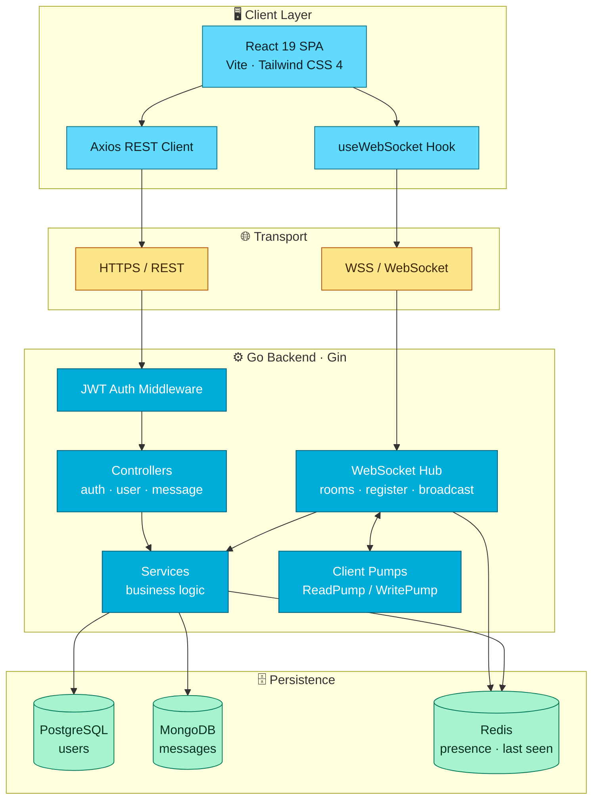
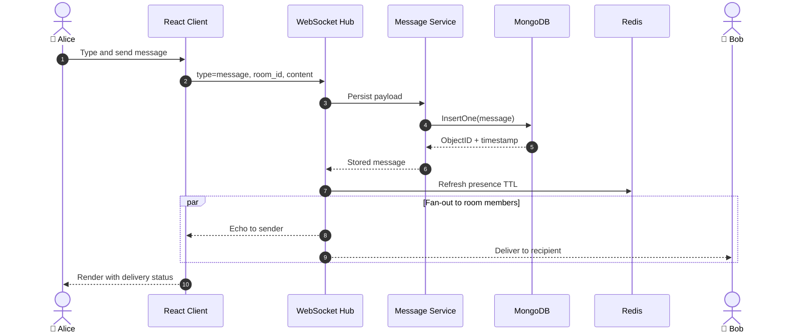
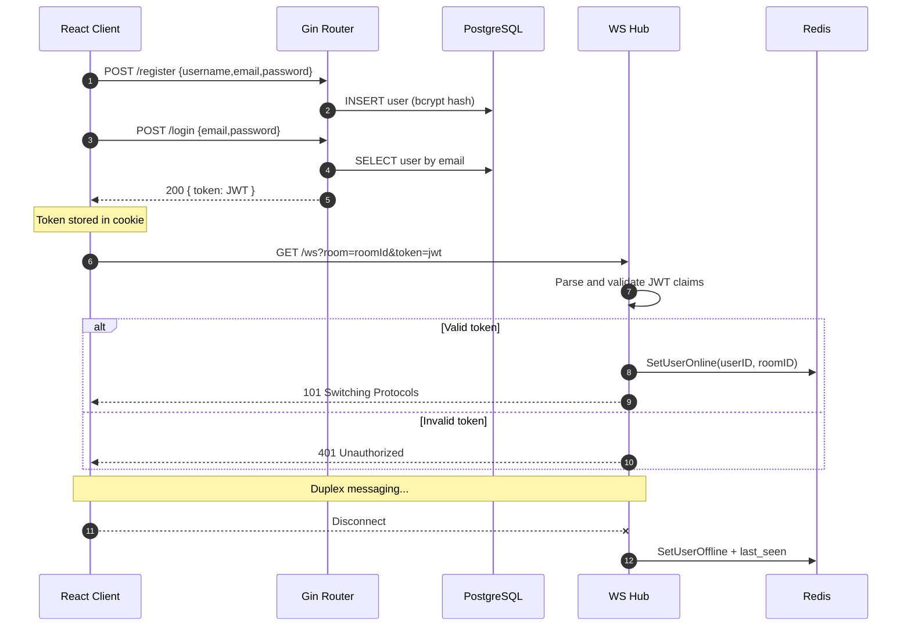
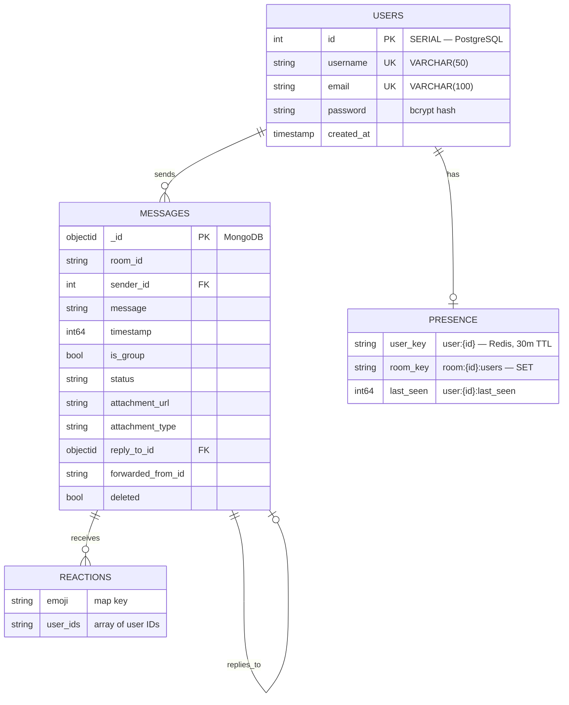
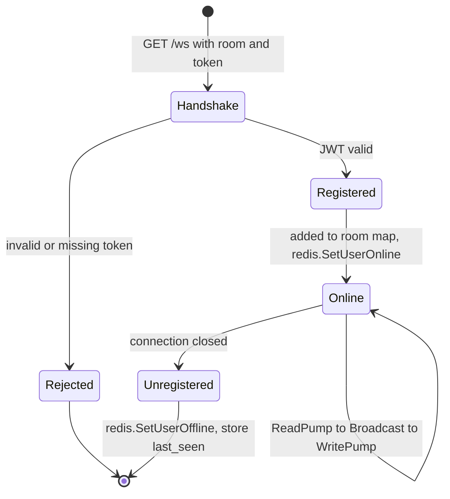

<div align="center">

# 💬 Go React Chat

### A real-time, polyglot-persistence chat platform built with **Go** and **React**

[](https://go.dev)
[](https://gin-gonic.com)
[](https://react.dev)
[](https://vite.dev)
[](https://tailwindcss.com)

[](https://www.postgresql.org)
[](https://www.mongodb.com)
[](https://redis.io)
[](https://github.com/gorilla/websocket)
[](https://www.docker.com)
[](LICENSE)

[Features](#-features) • [Architecture](#%EF%B8%8F-architecture) • [Quick Start](#-quick-start) • [API](#-api-reference) • [WebSocket](#-websocket-protocol) • [Structure](#-project-structure)

</div>

---

## 📖 Overview

**Go React Chat** is a full-stack real-time messaging application. A Go/Gin backend hosts a WebSocket hub for instant message fan-out, while a React 19 + Vite SPA delivers the chat experience. The system uses **polyglot persistence** — each datastore is chosen for what it does best:

| Datastore | Role | Why |
| :-- | :-- | :-- |
| 🐘 **PostgreSQL** | User accounts & credentials | Relational integrity, unique constraints, ACID |
| 🍃 **MongoDB** | Message documents | Flexible schema for reactions, replies, attachments |
| 🔴 **Redis** | Presence & last-seen | In-memory sets with TTL for online tracking |

---

## ✨ Features

<table>
<tr>
<td width="50%" valign="top">

### 💬 Messaging
- Real-time delivery over WebSockets
- Room-based broadcast (1:1 and group)
- Persistent chat history
- Reply-to-message threading
- Message forwarding metadata
- Soft delete (tombstoned messages)
- Attachment URL + type support

</td>
<td width="50%" valign="top">

### 👥 Presence & Social
- Online/offline tracking via Redis
- Last-seen timestamps
- Per-room online user lists
- Typing indicators
- Emoji reactions (add/remove)
- Debounced user search
- Default AI Agent chat partner

</td>
</tr>
<tr>
<td width="50%" valign="top">

### 🔐 Security
- JWT-based authentication
- bcrypt password hashing
- Protected route middleware (HTTP + WS)
- Token-authenticated WebSocket handshake
- Configurable CORS policy

</td>
<td width="50%" valign="top">

### 🎨 Experience
- Mobile-first responsive layout
- Collapsible sidebar on small screens
- Auto-reconnect with backoff
- Emoji picker
- Built-in WebSocket debug panel
- Tailwind CSS 4 styling

</td>
</tr>
</table>

---

## 🏗️ Architecture

### System Overview



### Message Flow — Send & Broadcast



### Authentication & Connection Lifecycle



### Data Model



---

## 🛠️ Tech Stack

| Layer | Technology |
| :-- | :-- |
| **Frontend** | React 19, React Router 7, Vite 7, Tailwind CSS 4, Axios, Lucide React, date-fns, js-cookie |
| **Backend** | Go 1.24, Gin, Gorilla WebSocket, golang-jwt v5, godotenv, gin-contrib/cors |
| **Databases** | PostgreSQL (`lib/pq`), MongoDB (`mongo-driver`), Redis (`go-redis/v9`) |
| **Security** | JWT (HS256), bcrypt via `golang.org/x/crypto` |
| **Tooling** | Docker, Docker Compose, ESLint 9, Air (hot reload) |

---

## 🚀 Quick Start

### Prerequisites

| Requirement | Version |
| :-- | :-- |
| Go | `1.24+` |
| Node.js | `18+` |
| PostgreSQL | `14+` |
| MongoDB | `6+` |
| Redis | `7+` |

### 1️⃣ Clone

```bash
git clone https://github.com/Kalpesh-Vala/go-react-chat.git
cd go-react-chat
```

### 2️⃣ Backend

Create `backend/.env`:

```env
PORT=8080

# PostgreSQL
POSTGRES_HOST=localhost
POSTGRES_PORT=5432
POSTGRES_USER=postgres
POSTGRES_PASSWORD=your_password
POSTGRES_DB=chatdb

# MongoDB
MONGODB_URI=mongodb://localhost:27017
MONGODB_DB=chatdb

# Redis
REDIS_ADDR=localhost:6379
REDIS_PASSWORD=

# Auth
JWT_SECRET=replace_with_a_long_random_secret
```

> [!WARNING]
> Never commit `.env` files. Generate `JWT_SECRET` from a cryptographically secure source, e.g. `openssl rand -base64 48`.

Run it:

```bash
cd backend
go mod tidy
go run main.go
```

The `users` table is created automatically on startup. The API listens on `http://localhost:8080`.

### 3️⃣ Frontend

Create `frontend/.env`:

```env
VITE_API_BASE_URL=http://localhost:8080
VITE_WS_BASE_URL=ws://localhost:8080
VITE_API_TIMEOUT=10000
VITE_APP_ENV=development
VITE_WS_RECONNECT_INTERVAL=3000
VITE_WS_MAX_RECONNECT_ATTEMPTS=5
VITE_MAX_MESSAGE_LENGTH=1000
VITE_TYPING_TIMEOUT=3000
VITE_MAX_FILE_SIZE=10485760
VITE_ALLOWED_FILE_TYPES=image/jpeg,image/png,image/gif,application/pdf
VITE_DEBUG_MODE=true
```

Run it:

```bash
cd frontend
npm install
npm run dev
```

The app opens at `http://localhost:5173`.

### 4️⃣ Docker (optional)

```bash
cd backend
docker compose up --build
```

See [backend/DOCKER_README.md](backend/DOCKER_README.md) for details.

---

## 📡 API Reference

Base URL: `http://localhost:8080`

### 🔐 Authentication

| Method | Endpoint | Auth | Description |
| :--: | :-- | :--: | :-- |
| `POST` | `/register` | ❌ | Create a new account |
| `POST` | `/login` | ❌ | Exchange credentials for a JWT |

<details>
<summary><b>Request &amp; response examples</b></summary>

```http
POST /register
Content-Type: application/json

{ "username": "john_doe", "email": "john@example.com", "password": "securepassword123" }
```
```json
{ "message": "User registered" }
```

```http
POST /login
Content-Type: application/json

{ "email": "john@example.com", "password": "securepassword123" }
```
```json
{ "token": "eyJhbGciOiJIUzI1NiIsInR5cCI6IkpXVCJ9..." }
```
</details>

### 👤 Users

| Method | Endpoint | Auth | Description |
| :--: | :-- | :--: | :-- |
| `GET` | `/users` | ✅ | List all users |
| `GET` | `/users/search?q=<term>` | ✅ | Case-insensitive search by username or email (max 20) |

> Send the token as `Authorization: Bearer <JWT>`.

### 💬 Messages

| Method | Endpoint | Auth | Description |
| :--: | :-- | :--: | :-- |
| `POST` | `/message` | ❌ | Store a message |
| `GET` | `/messages?room_id=<id>` | ❌ | Fetch room history |
| `POST` | `/message/reaction/add` | ❌ | Add an emoji reaction |
| `POST` | `/message/reaction/remove` | ❌ | Remove an emoji reaction |
| `POST` | `/message/delete` | ❌ | Soft-delete a message |

<details>
<summary><b>Request &amp; response examples</b></summary>

```http
POST /message
Content-Type: application/json

{
  "room_id": "room_123",
  "sender_id": 1,
  "message": "Hello, World!",
  "is_group": false,
  "status": "sent"
}
```
```json
{
  "status": "Message stored",
  "message_id": "507f1f77bcf86cd799439011",
  "timestamp": 1642771200,
  "room_id": "room_123",
  "sender_id": 1
}
```

```http
GET /messages?room_id=room_123
```
```json
{
  "messages": [
    {
      "id": "507f1f77bcf86cd799439011",
      "room_id": "room_123",
      "sender_id": 1,
      "message": "Hello, World!",
      "timestamp": 1642771200,
      "deleted": false,
      "reactions": { "👍": ["1", "2"] }
    }
  ],
  "total_count": 1,
  "room_id": "room_123"
}
```

```http
POST /message/reaction/add
Content-Type: application/json

{ "message_id": "507f1f77bcf86cd799439011", "emoji": "👍", "user_id": "1" }
```
</details>

### 🟢 Presence & Utility

| Method | Endpoint | Auth | Description |
| :--: | :-- | :--: | :-- |
| `GET` | `/online-users` | ❌ | Online users in a room |
| `GET` | `/user-status` | ❌ | Online flag + last-seen timestamp |
| `GET` | `/ping` | ❌ | Health check |
| `GET` | `/debug/messages` | ❌ | Dump all stored messages |

> [!CAUTION]
> `/debug/messages` exposes the entire message store, and the message endpoints are currently unauthenticated. Remove the debug route and place the message routes behind `AuthMiddleware()` before deploying to production.

---

## 🔌 WebSocket Protocol

**Endpoint:** `ws://localhost:8080/ws?room=<room_id>&token=<jwt>`

Both query parameters are required. The server validates the JWT, extracts `user_id` and `username`, registers the client into the room, and marks it online in Redis.

### Client ➜ Server

<table>
<tr><th align="left">Type</th><th align="left">Payload</th></tr>
<tr><td><code>message</code></td><td>

```json
{
  "type": "message",
  "room_id": "room_123",
  "sender_id": 1,
  "content": "Hello!",
  "is_group": false,
  "reply_to_id": "507f1f77bcf86cd799439011"
}
```
</td></tr>
<tr><td><code>typing</code></td><td>

```json
{
  "type": "typing",
  "room_id": "room_123",
  "user_id": 1,
  "username": "john_doe",
  "is_typing": true
}
```
</td></tr>
<tr><td><code>reaction</code></td><td>

```json
{
  "type": "reaction",
  "message_id": "507f1f77bcf86cd799439011",
  "room_id": "room_123",
  "user_id": 1,
  "emoji": "👍",
  "action": "add"
}
```
</td></tr>
</table>

### Hub Lifecycle



---

## 📁 Project Structure

```
go-react-chat/
├── backend/                     # 🐹 Go + Gin API server
│   ├── main.go                  # Entry point: env, DB init, CORS, routes
│   ├── config/                  # .env loading
│   ├── routes/                  # Route registration & hub wiring
│   ├── controllers/             # HTTP handlers (auth, user, message, websocket)
│   ├── services/                # Business logic layer
│   ├── models/                  # User & Message structs
│   ├── db/
│   │   ├── postgres/            # Connection + users table bootstrap
│   │   ├── mongodb/             # Message collection client
│   │   └── redis/               # Presence & last-seen helpers
│   ├── internal/
│   │   ├── middleware/jwt.go    # Bearer token auth middleware
│   │   ├── websocket/           # Hub, client pumps, handler, payload types
│   │   └── encryption/          # Reserved for E2E encryption
│   ├── utils/logger.go
│   ├── Dockerfile               # Multi-stage build, non-root runtime
│   └── docker-compose.yml
│
├── frontend/                    # ⚛️ React 19 + Vite SPA
│   ├── src/
│   │   ├── App.jsx              # Router + auth guards
│   │   ├── config/index.js      # VITE_* env consumption
│   │   ├── context/             # AuthContext provider
│   │   ├── hooks/               # useWebSocket
│   │   ├── services/api.js      # Axios instance & API calls
│   │   ├── components/
│   │   │   ├── ProtectedRoute.jsx
│   │   │   └── chat/            # Sidebar, container, list, input, bubbles…
│   │   ├── pages/               # Home, Login, Register, Dashboard, Chat, Profile
│   │   └── utils/               # auth, chatHistory, helpers
│   ├── vite.config.js
│   └── vercel.json
│
├── LICENSE
└── README.md
```

---

## ⚙️ Environment Variables

### Backend

| Variable | Description | Default |
| :-- | :-- | :-- |
| `PORT` | HTTP listen port | `8080` |
| `POSTGRES_HOST` / `POSTGRES_PORT` | PostgreSQL host & port | — |
| `POSTGRES_USER` / `POSTGRES_PASSWORD` | PostgreSQL credentials | — |
| `POSTGRES_DB` | Database name | — |
| `MONGODB_URI` | MongoDB connection string | — |
| `REDIS_ADDR` | Redis address | — |
| `JWT_SECRET` | HS256 signing secret | — |

### Frontend

| Variable | Description | Default |
| :-- | :-- | :-- |
| `VITE_API_BASE_URL` | REST API base URL | `http://localhost:8080` |
| `VITE_WS_BASE_URL` | WebSocket base URL | `ws://localhost:8080` |
| `VITE_API_TIMEOUT` | Axios timeout (ms) | `10000` |
| `VITE_APP_ENV` | `development` / `production` | `development` |
| `VITE_WS_RECONNECT_INTERVAL` | Reconnect delay (ms) | `3000` |
| `VITE_WS_MAX_RECONNECT_ATTEMPTS` | Max reconnect attempts | `5` |
| `VITE_MAX_MESSAGE_LENGTH` | Character limit per message | `1000` |
| `VITE_TYPING_TIMEOUT` | Typing indicator timeout (ms) | `3000` |
| `VITE_MAX_FILE_SIZE` | Upload limit (bytes) | `10485760` |
| `VITE_ALLOWED_FILE_TYPES` | Allowed MIME types (comma separated) | image/PDF set |
| `VITE_DEBUG_MODE` | Verbose logging | `false` |

Full details: [frontend/ENV_README.md](frontend/ENV_README.md)

---

## 🧪 Development Scripts

| Command | Location | Purpose |
| :-- | :-- | :-- |
| `go run main.go` | `backend/` | Start the API server |
| `go mod tidy` | `backend/` | Sync dependencies |
| `go build -o main .` | `backend/` | Produce a binary |
| `npm run dev` | `frontend/` | Vite dev server with HMR |
| `npm run build` | `frontend/` | Production bundle |
| `npm run preview` | `frontend/` | Serve the production build |
| `npm run lint` | `frontend/` | ESLint check |

---

## 🗺️ Roadmap

- [ ] End-to-end encryption (`internal/encryption` is scaffolded but empty)
- [ ] Authenticate all message endpoints with `AuthMiddleware`
- [ ] Load `JWT_SECRET` from env in the WebSocket handler instead of a hardcoded key
- [ ] Restrict CORS and WebSocket `CheckOrigin` to known origins
- [ ] File/image upload pipeline with object storage
- [ ] Group chat management (create, invite, leave)
- [ ] Read receipts and delivery acknowledgements
- [ ] Push notifications
- [ ] Automated test suite and CI pipeline

---

## 🤝 Contributing

1. Fork the repository
2. Create a branch — `git checkout -b feature/your-feature`
3. Commit your changes — `git commit -m "feat: add your feature"`
4. Push — `git push origin feature/your-feature`
5. Open a Pull Request

---

## 📄 License

Released under the [MIT License](LICENSE). © 2025 Kalpesh Vala.

---

<div align="center">

**Built with 🐹 Go and ⚛️ React**

[⬆ Back to top](#-go-react-chat)

</div>